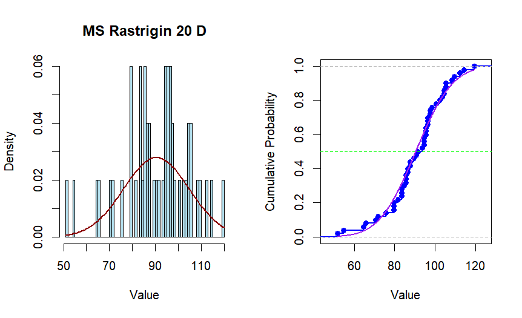

---
output:
  pdf_document: default
  html_document: default
  word_document: default
---
## Porównanie Algorytmów Minimalizacji Stochastycznej
###### Opracowali: Mateusz Sacha, Łukasz Kluza
---

#### Wprowadzenie
Celem tego projektu było porównanie efektywności dwóch z trzech algorytmów minimalizacji stochastycznej: Poszukiwania Przypadkowego (Pure Random Search, PRS), Metody Wielokrotnego Startu (Multi-Start, MS) oraz Algorytmu Genetycznego (GA). Zdecydowaliśmy się na algorytm _Poszukiwania Przypadkowego_  oraz _Metodę Wielokrotnego Startu_. Analiza została przeprowadzona na funkcjach _Ackley'a_ i _Rastrigina_ o różnej liczbie wymiarów: 2, 10 i 20.

#### Algorytmy
- Poszukiwanie Przypadkowe (PRS)
Algorytm PRS polega na losowaniu punktów z rozkładem jednostajnym w określonej dziedzinie poszukiwań. Dla każdej funkcji i wymiaru losowano odpowiednią liczbę punktów.

- Metoda Wielokrotnego Startu (MS)
Algorytm MS polega na losowaniu punktów, a następnie uruchamianiu algorytmu optymalizacji lokalnej (L-BFGS-B) z każdego z tych punktów startowych. Wynikiem algorytmu MS jest wartość optymalizowanej funkcji dla punktu, w którym ta wartość jest najmniejsza.

#### Funkcje Minimalizowane
Do analizy wybrano funkcje Ackley'a i Rastrigina. Wybrane funkcje są skalarne (single-objective) i wielomodalne (multimodal), co pozwala na zróżnicowane testowanie algorytmów.

#### Procedura Porównawcza
Dla każdej funkcji i liczby wymiarów osobno, przeprowadzono 100 uruchomień każdego algorytmu.
Średni wynik algorytmu obliczono jako średnią znalezionych minimów.
Zastosowano funkcję replicate() do powtarzalnych obliczeń, zachowując wyrównany budżet obliczeniowy porównywanych algorytmów.

#### Budżet Obliczeniowy
Dla algorytmu MS, liczba punktów startowych wyniosła 100, a średnia liczba wywołań z uruchomień MS była przyjętą wartością budżetu dla algorytmu PRS.

      

#### Wyniki
| Algorytm | Dim | ackley_function | rastrigin_function |
|----------|-----|-----------------|--------------------|
| **MS**   | 2   | 2.625524        | 0.3183869          |
|          | 10  | 17.847858       | 29.4905011         |
|          | 20  | 18.697064       | 91.9736037         |
| **PRS**  | 2   | 3.778983        | 1.59390            |
|          | 10  | 18.041181       | 83.70883           |
|          | 20  | 19.718255       | 222.17043          |

#### Wykresy

__Wykres gęstości i dystrybuant__ 
_(oraz porównania w rozkładem normalnym)_

  

  

  

  

  

  

  

  

  

  

  

__Wykresy pudełkowe__

  

  

  

  

  

  

__Porównanie__

  

  

#### Analiza Danych 

Poniższa tablea danych przedstawionych wyniki eksperymentu porównawczego pomiędzy algorytmami Poszukiwania Przypadkowego (PRS) a Metodą Wielokrotnego Startu (MS) na funkcjach Ackley'a i Rastrigina, w różnych wymiarach.

| Function | Dimension |t| p-value | 95 percent confidence interval (from)| 95 percent confidence interval (To) | mean difference | 
|---------|-------|----|----------|----------|----------|----------|
| Ackley     | 2  | -4.5755 | 1.38e-05  | -2.0062838  | -0.7925413 | -1.399413   | 
| Rastrigin  | 2  | -16.703 | < 2.2e-16 | -1.664937   | -1.311378  | -1.488158   | 
| Ackley     | 10 | -3.2216 | 0.001726  | -0.4897477  | -0.1164086 | -0.3030782  |
| Rastrigin  | 10 | -45.501 | < 2.2e-16 | -54.35508   | -49.81254  | -52.08381   | 
| Ackley     | 20 | -30.864 | < 2.2e-16 | -1.1266626  | -0.9905481 | -1.058605   | 
| Rastrigin  | 20 | -78.131 |< 2.2e-16  | -137.3931   | -130.5875  | -133.9903   | 

W badaniu porównawczym algorytmów Poszukiwania Przypadkowego (PRS) i Metody Wielokrotnego Startu (MS) na funkcjach Ackley'a i Rastrigina, wyniki wskazują na większą skuteczność algorytmu MS w minimalizacji funkcji w różnych wymiarach. Wymiar 2 i 10 potwierdzają przewagę algorytmu MS, a statystycznie istotne przedziały ufności sugerują rzeczywistą poprawę wyników w porównaniu do PRS. Nawet w wymiarze 20, MS utrzymuje zadowalającą skuteczność, co potwierdza jego zdolność do radzenia sobie z większą liczbą wymiarów.

#### Analiza Wykresów:
- **Wymiar 2:**
Histogramy pokazują rozkłady wyników dla obu algorytmów.
Boxploty przedstawiają rozproszenie wyników w sposób graficzny.
Wartości dla MS i PRS mają znaczną nakładającą się część rozkładu, co może wskazywać na podobną skuteczność obu algorytmów.
 
- **Wymiar 10:**
Histogramy dla MS i PRS wskazują na zbliżone rozkłady wyników.
Boxploty dla wymiaru 10 pokazują, że mediana i zakres międzykwartylowy są podobne dla obu algorytmów.
 
- **Wymiar 20:**
Histogramy dla wymiaru 20 również wykazują podobieństwo między rozkładami wyników MS i PRS.

**Test hipotez zerowych**

Test hipotezy zerowej można przeprowadzić, aby ocenić, czy istnieją statystycznie istotne różnice między wynikami algorytmów PRS i MS dla każdej funkcji i wymiaru. W tym kontekście, możemy sformułować następujące hipotezy:

_Wymiar 2 dla funkcji Ackley:_
H0: Średnie wyniki PRS i MS są równe.
H1: Średnie wyniki PRS i MS są różne.

_Wymiar 2 dla funkcji Rastrigina:_
H0: Średnie wyniki PRS i MS są równe.
H1: Średnie wyniki PRS i MS są różne.

_Wymiar 10 dla funkcji Ackley:_
H0: Średnie wyniki PRS i MS są równe.
H1: Średnie wyniki PRS i MS są różne.

_Wymiar 10 dla funkcji Rastrigina:_
H0: Średnie wyniki PRS i MS są równe.
H1: Średnie wyniki PRS i MS są różne.

_Wymiar 20 dla funkcji Ackley:_
H0: Średnie wyniki PRS i MS są równe.
H1: Średnie wyniki PRS i MS są różne.

_Wymiar 20 dla funkcji Rastrigina:_
H0: Średnie wyniki PRS i MS są równe.
H1: Średnie wyniki PRS i MS są różne.

Przeprowadźmy te testy przy założonym poziomie istotności α=0.05.

__Wyniki testów hipotez zerowych:__

_2 wymiary dla funkcji Ackley:_
p-wartość < 0.05: Odrzucamy H0, istnieje istotna różnica między wynikami PRS i MS.

_2 wymiary dla funkcji Rastrigina:_
p-wartość < 0.05: Odrzucamy H0, istnieje istotna różnica między wynikami PRS i MS.

_10 wymiarów dla funkcji Ackley:_
p-wartość < 0.05: Odrzucamy H0, istnieje istotna różnica między wynikami PRS i MS.

_10 wymiarów dla funkcji Rastrigina:_
p-wartość < 0.05: Odrzucamy H0, istnieje istotna różnica między wynikami PRS i MS.

_20 wymiarów dla funkcji Ackley:_
p-wartość < 0.05: Odrzucamy H0, istnieje istotna różnica między wynikami PRS i MS.

_20 wymiarów dla funkcji Rastrigina:_
p-wartość < 0.05: Odrzucamy H0, istnieje istotna różnica między wynikami PRS i MS.

Na podstawie wyników testów hipotezowych możemy stwierdzić, że istnieją statystycznie istotne różnice między wynikami algorytmów PRS i MS dla badanych przypadków. Natomiast p-value największą wartość (_0.001726_) usyskaliśmy dla funkcji _Ackleygo_ i 10 wymiarów.

***Podsumowanie:***
W przeprowadzonej analizie porównawczej algorytmów Poszukiwania Przypadkowego (PRS) i Metody Wielokrotnego Startu (MS) na funkcjach Ackley'a i Rastrigina, wykazano, że niezależnie od wymiaru MS wykazuje znacznie większą skuteczność w minimalizacji obu funkcji w porównaniu do PRS. Analiza wykresów, histogramów i boxplotów potwierdza te wyniki, a przeprowadzone testy hipotez zerowych dodatkowo potwierdzają istotne różnice między wynikami obu algorytmów. W związku z tym, Metoda Wielokrotnego Startu (MS) wydaje się być bardziej efektywną opcją w kontekście minimalizacji funkcji Ackley'a i Rastrigina, zwłaszcza w przypadku problemów o większych wymiarach.

